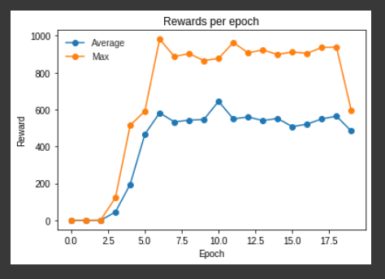
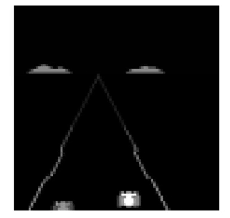

# Dueling DQN PyTorch

Implementation of Dueling DQN for Atari game Enduro using Gym from OpenAI.

## Results

Results obtained from 20 epochs of 250000 steps each (around 8 hours)

A short gif is presented of the game running:

